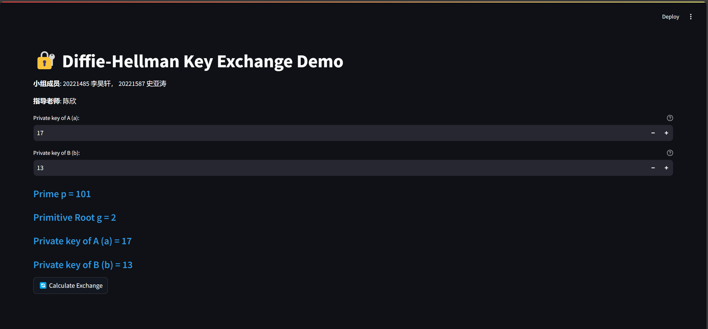
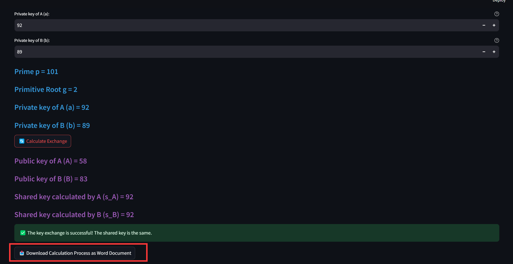
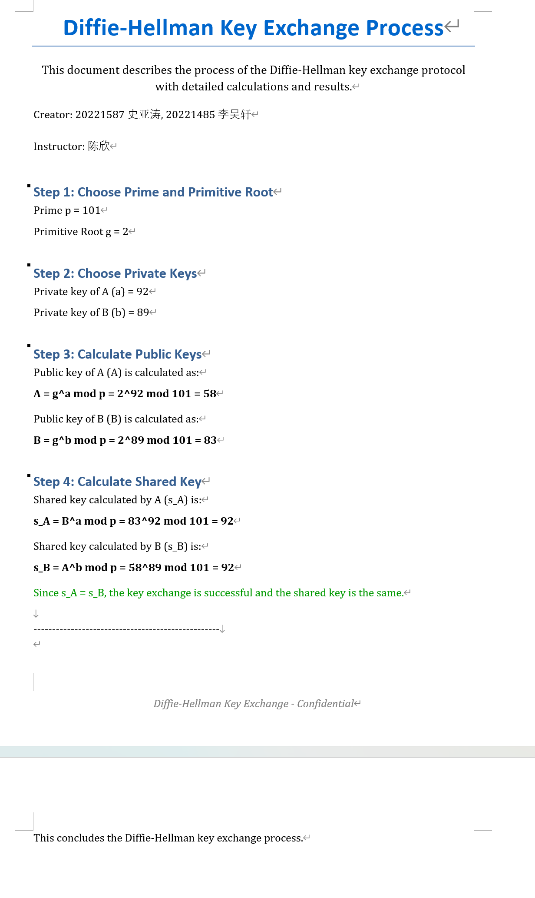

# Diffie-Hellman密钥交换协议

## 1.引言

### 1.1项目背景

随着网络技术的飞速发展，网络通信在人们的生活与工作中占据着极为关键的地位。在各类网络应用场景里，数据的安全传输成为了重中之重，尤其是在金融交易、机密信息传递以及远程访问控制等领域，确保数据不被未授权的第三方窃取或篡改是保障业务正常开展的核心要素之一。

加密技术是保障数据安全传输的关键手段，而密钥交换协议则是加密技术体系中不可或缺的基础环节。Diffie-Hellman 密钥交换协议作为一种开创性的密钥交换方法，在现代密码学领域具有举足轻重的地位。它允许通信双方在不安全的公共信道上协商出一个共享的密钥，该密钥随后可用于对称加密算法对通信数据进行加密和解密操作，从而确保数据传输的机密性。

传统的对称加密算法在加密和解密时使用相同的密钥，这就面临着密钥分发的难题，若直接在不安全信道传输密钥，极易被攻击者截获。Diffie-Hellman 密钥交换协议巧妙地解决了这一问题，它无需事先共享密钥，而是通过双方在公共信道上交换特定信息，各自基于本地的秘密参数计算出相同的共享密钥。

然而，Diffie-Hellman 密钥交换协议本身涉及到较为复杂的数学原理，包括离散对数问题等，其计算过程和安全性分析对于密码学初学者来说存在一定的理解和掌握难度。本项目旨在通过实现 Diffie-Hellman 密钥交换协议，帮助学习者深入理解密钥交换协议的核心概念、数学基础以及实际运行机制，为他们进一步学习更为复杂的密码学知识和深入探索网络安全领域奠定坚实的基础，同时也为在实际应用场景中构建安全可靠的通信系统提供有力的技术支撑。

### 1.2变量解释

- **p**：**素数**，用于 Diffie-Hellman 密钥交换中的模运算。它是一个大于2的质数，A 和 B 的公钥都是基于该素数进行计算的，确保密钥交换的安全性。
- **g**：**原根**，是素数 `p` 的一个生成元。它是一个整数，满足 `g` 的不同幂次模 `p` 可以生成从1到 `p-1` 的所有数。原根在 Diffie-Hellman 密钥交换中用于计算公钥。
- **a**：**A的私钥**，A 方选择的私有密钥，通常是一个在 1 到 `p-1` 之间的整数。A 使用该私钥与原根 `g` 以及素数 `p` 来计算其公钥 `A`。
- **b**：**B的私钥**，B 方选择的私有密钥，通常是一个在 1 到 `p-1` 之间的整数。B 使用该私钥与原根 `g` 以及素数 `p` 来计算其公钥 `B`。
- **A**：**A的公钥**，由 A 方使用私钥 `a` 和原根 `g`、素数 `p` 计算得出。计算公式为 $A = g^a % p$。
- **B**：**B的公钥**，由 B 方使用私钥 `b` 和原根 `g`、素数 `p` 计算得出。计算公式为 $B = g^b % p$。
- **s_A**：**A计算的共享密钥**，A 方根据 B 的公钥 `B` 和自己的私钥 `a` 计算得到共享密钥。计算公式为 $S_A = B^a % p$。
- **s_B**：**B计算的共享密钥**，B 方根据 A 的公钥 `A` 和自己的私钥 `b` 计算得到共享密钥。计算公式为 $S_B = A^b % p$。
- **byte_io**：**内存中的字节流**，用于保存 Diffie-Hellman 密钥交换过程的详细记录（包括选择的素数 `p`、原根 `g`、私钥和公钥计算过程等）。该字节流以便于用户通过 `Streamlit` 下载保存。
- **doc**：**Word文档对象**，用于将 Diffie-Hellman 密钥交换的计算过程记录到 Word 文档中，包含所有关键步骤，如选择素数和原根、计算公钥和共享密钥等。
- **st**：**Streamlit对象**，用于创建交互式 Web 界面，展示应用的输入输出，允许用户输入私钥并触发密钥交换过程，同时显示计算结果和下载链接。
- **sympy**：**SymPy对象**，用于执行数学运算，如生成素数、判断素数、生成随机素数等。此库用于计算和验证 Diffie-Hellman 算法所需的数值。

##  2.运行环境

### 2.1硬件

- CPU:AMD Ryzen 7 5800H with Radeon Graphics            3.20 GHz
- GPU:NVIDIA GeForce RTX 3050 Laptop GPU

### 2.2软件

- 操作系统：Windows 11
- 开发环境：Pycharm 2024.1.3
- Python版本：3.11.10
- Python库：streamlit、sympy 、python-docx

## 3.使用说明

### 3.1安装与初始化

#### 3.1.1安装Pycharm

- 如果您没有安装Pycharm，请先下载安装[Pycharm](https://www.jetbrains.com/pycharm/download/?sectio)。你可以在Bilibili上查找安装教程或查看官方文档。

#### 3.1.2下载代码

- 您可以从此[链接](https://github.com/Yhaokaf/Simple-implementation-of-Diffie-Hellman-key-exchange-protocol/archive/refs/heads/master.zip)下载我们的代码压缩包,将其解压后部署到您的计算机中运行。

- 下载完成后，进入您的项目终端，输入`streamlit run DH.py`并运行，进入UI界面。

  

## 4.运行说明

### 4.1 Diffie-Hellman密钥交换过程

#### 4.1.1 密钥交换模块

- **素数（p）**：211
- **原根（g）**：6
- **私钥A（a）**：53
- **私钥B（b）**：137
- **公钥A（A）**：
  $g^a \mod p = 6^{53} \mod 211 = 145$
  
- **公钥B（B）**：
  $g^b \mod p = 6^{137} \mod 211 = 44$
- **共享密钥A（s_A）**：
  $B^a mod p = 44^{53}\mod 211 = 42$
- **共享密钥B（s_B）**：
  $A^b mod p = 145^{137}\mod 211 = 42$
  
- **交叉验证**：
  由于共享密钥A和共享密钥B相等，密钥交换成功，最终的共享密钥为 `42`。

#### 4.1.2 生成的文档

- **文档内容**：该文档详细描述了Diffie-Hellman密钥交换的每个步骤，包括选择素数和原根、私钥、计算公钥以及最终的共享密钥。用户可以点击下方按钮下载docx文件查看过程。

  

- **格式**：文档内容以表格和文字的形式展示了过程中的各个计算公式，且提供了成功或失败的消息提示。

## 5.联系我们

### 5.1关于我们

-  课程名称：信息安全导论
- 教学班级：992987-003
- 任课教师：陈欣
- 单位：重庆大学大数据与软件学院
- 主管部门：重庆大学大数据与软件学院2022级人工智能
- 小组成员：史亚涛 李昊轩

### 5.2联系方式

邮箱：

- 1205980441@qq.com 
- Yhaokaf@gmail.com 

